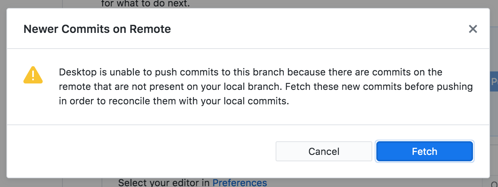
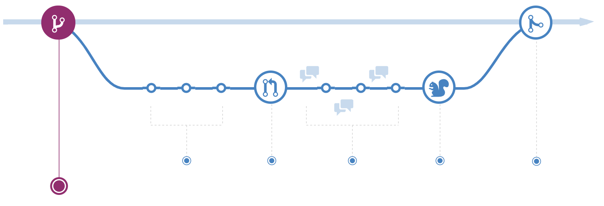

```{r setup, include=FALSE}
options(htmltools.dir.version = FALSE)
```

```{r xaringan-themer, include=FALSE, warning=FALSE}
library(xaringanthemer)
style_mono_accent(
  base_color = "#09274B",
  base_font_size = "32px", 
  header_h1_font_size = "2.0rem",
  header_h2_font_size = "1.5rem",
  header_h3_font_size = "1.25rem", 
  header_background_content_padding_top = "2rem", 
  header_font_google = google_font("Lato"),
  text_font_google   = google_font("Montserrat", "300", "300i", "500"),
  code_font_google   = google_font("Source Code Pro", "300", "500"), 
  extra_css = list("p" = list("margin-block-start" = "0.5em", 
                              "margin-block-end" = "0.5em"), 
                   "ul" = list("margin-block-start" = "0.5em", 
                              "margin-block-end" = "0.5em"), 
                   "li" = list("margin-block-start" = "0.5em", 
                              "margin-block-end" = "0.5em"), 
                   "pre" = list("margin-top" = "0.5em", 
                              "margin-bottom" = "0.5em"), 
                   ".caption" = list("display" = "none"),
                   ".small" = list("font-size" = "80%")), 
  link_color = "#339944"
)
```
class: inverse, center, middle

# `r rmarkdown::metadata$title`
### `r rmarkdown::metadata$author`
### `r rmarkdown::metadata$institute`
### (updated: `r Sys.Date()`)

---
# Motivations

* One of the advantages for using version control is managing collaborative work.
* Git is a flexible tool that accommodates many different styles of collaboration... not all of these styles are suitable for small research teams.
* "GitHub flow" is a workflow that is lightweight and scales well for individuals and small teams.

---
# Learning Outcomes

* describe how merge conflicts originate and how to resolve them
* apply the "GitHub flow" workflow for collaborating
* create and navigate branches on GitHub and using GitHub Desktop
* create and merge pull requests
* understand "forks" and open-source-community development on GitHub

---
# Prerequisites

This lesson assumes you:
* have some familiarity making *repos* and *commits*
* know how to synchronize repos from your computer to GitHub

---
class: inverse, center, middle

# Merge Conflicts

---
# Inviting Collaborators

* I have a github repo, and would like to give my collaborator access to work on the project.
* From the github repo page:
  - `Settings` -> `Manage access`
  - `Invite a collaborator`

---
```{r, echo = FALSE, fig.cap = "A screenshot of the website https://github.com/ha0ye/portalDS/settings/access, showing that the repo is visible to the public, and that only the owner can contribute to the repository. There is a green button with the text 'Invite a collaborator'."}
knitr::include_graphics("github-manage-access.png")
```

---
# A Simple Workflow

Two people, A and B, are working together on one repo in GitHub:
* A makes commits, A pushes the new commits to GitHub.
* B pulls the latest commits from A, works on new commits, and pushes their new commits back to GitHub.
* A pulls the latest commits from B, works on new commits, etc.

---
# What happens if you forget to pull?

You get a warning when you try to push to GitHub.

```{r, echo = FALSE, fig.cap = "A screenshot of the warning from using GitHub Desktop when trying to push new commits to GitHub, and there are commits on GitHub that have not yet been fetched and merged locally. The warning reads 'Newer Commits on Remote; Desktop is unable to push commits to this branch because there are commits on the remote that are not present on your local branch. Fetch these new commits before pushing in order to reconcile them with your local commits.'"}

```

---
# Merging

* a `git merge` combine the changes from diverging commits:
  - suppose A and B start with commit: `{orig}`
  - A makes a commit, `{a}`, with changes
  - B makes a commit, `{b}`, with changes
  - `git merge` combines `{a}` and `{b}` into a new commit `{c}`, that contains both sets of changes.
  
---
# Merging (automatically)

* if the changes are in different files

  OR different parts of the same files
  - git is generally able to combine the changes without further intervention

* if git is unable to merge automatically, then it is a `merge conflict`

---
# Resolving merge conflicts

* when git cannot combine the changes automatically, you must manually create the merged file:
```{r, echo = FALSE, fig.cap = "A screenshot of BBedit showing the merge conflict. Line 6 is '<<<<<<< HEAD'`' indicating the start of one version of the file. Line 8 is '=======' indicating the end of one version and the beginning of the next. Line 10 shows '>>>>>>>' followed by a hash, indicating the end of the second version."}
knitr::include_graphics("merge-conflict.png")
```

---
# Resolving merge conflicts 2

* After the conflicts are resolved, you need to create a new commit with the merged edits.
* This merged commit can then be pushed to github without issue.
* For non-text files, you may need to revert back to one or the other version (whichever is correct)

---
# Summary

* This approach works pretty well when there is one primary contributor, and collaborators rarely make changes.
  - otherwise everyone needs to be constantly pulling and merging, contacting each other through separate channels to let them know you are done pushing changes to GitHub, etc.

---
class: inverse, center, middle

# GitHub Flow

---
# Essentials of GitHub Flow

Manage work using branches - `merge` branches back to the primary branch when ready.

```{r, echo = FALSE, fig.cap = "A screenshot of the diagram from https://guides.github.com/introduction/flow/, showing conceptually how the 'GitHub flow' workflow works."}

```

---
# Steps

1. Create a branch and switch to it.
2. Add commits with desired changes.
3. Open a pull request (PR).
4. Review the PR if necessary, and merge.
5. Delete branch if done.

---
class: inverse, center, middle

# Navigating Branches

---
# What is a Branch?

* A `branch` is a label for a set of commits.

```{r, echo = FALSE, out.width = "80%", fig.cap = "A diagram from https://www.atlassian.com/git/tutorials/using-branches, of a git repo represented in a diagram with commits as circular nodes, with edges between them showing the relationship between commits and their parents. There is a `Master` branch in light blue, a `Little Feature` branch in purple with one commit, and a `Big Feature` branch in green with 3 commits."}
knitr::include_graphics("git-branch.svg")
```
.small[[img: https://www.atlassian.com/git/tutorials/using-branches]]

---
# How do branches work?

* By default, you are in the primary branch.
  - each commit has changes from the previous commit
  - a linear sequence of versions of the project
* When you want to make changes and commits without disrupting the primary branch:
  - create a new branch
  - merge when ready

---
# Creating new branches (GitHub)

```{r, echo = FALSE, fig.cap = "screenshot of the GitHub interface, when clicking on the pulldown menu to switch branches; this interface also enables one to create new branches."}
knitr::include_graphics("github-new-branch.png")
```

---
class: center, middle

# DEMO

---
# Creating new branches (GitHub Desktop)

```{r, echo = FALSE, fig.cap = "screenshot of the GitHub Desktop interface, when clicking on the pulldown menu to switch branches; this interface also enables one to create new branches."}
knitr::include_graphics("github-desktop-new-branch.png")
```

---
class: center, middle

# DEMO

---
class: inverse, center, middle

# Merging Branches

---
# Merging (branches)

* Nearly the same as merging commits:
  - merge the last commit on another branch to the current branch.

1. switch to the branch that will keep the merged result
2. merge from the other branch

---
class: center, middle

# DEMO (GitHub Desktop)

---
# Pull Request (GitHub)

* recommended practice for merges on GitHub
* lets you document the merge
  - can request official "review"
  - other collaborators can comment, make further changes

---
class: center, middle

# DEMO (GitHub)

---
class: inverse, center, middle

# Community-oriented Development on GitHub

---
# Issues

* reported bugs, feature requests, etc.
* anyone can contribute to discussion
* can be referred to by number in commits and pull requests

---
class: center, middle

# DEMO

---
# Forks

* How do you contribute to other people's projects?
  - Fork = clone a repo on GitHub
  - Forks retain memory of original repo (and cannot have their own issues)
  - Pull Requests can merge from across forks.

* "Fork and PR" is a common phrase indicating how one should contribute to an open-source project.

---
# Thanks

* Let me know what content you'd like to see
* Contact me for additional questions or consultation requests!
* Check back in on the libguide for more modules and contact info:
  - https://guides.uflib.ufl.edu/reproducibility
